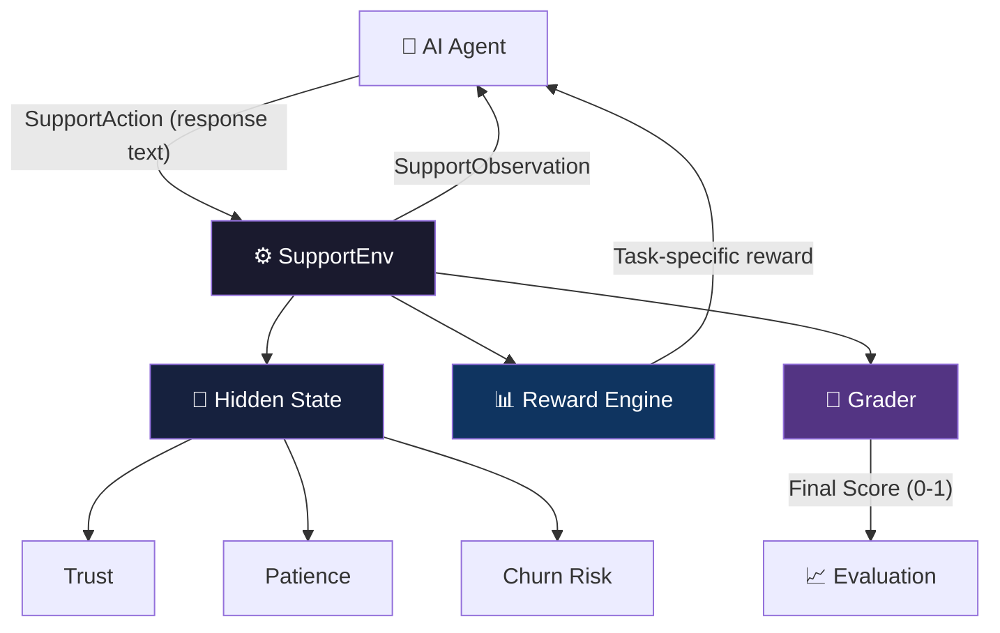
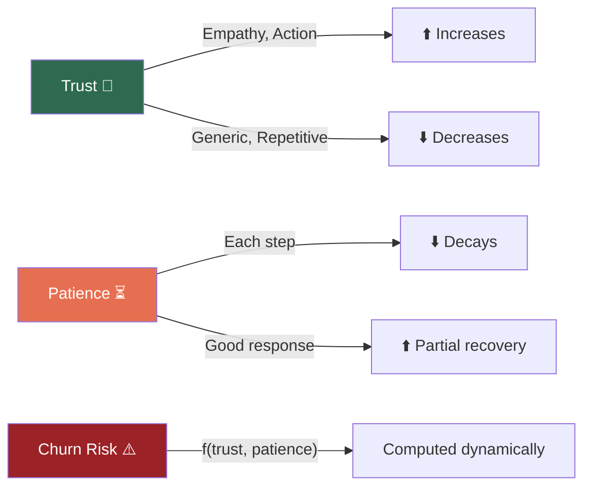

# 🚀 SupportOps-RL: Customer Support Simulation Environment

> **A Real-World OpenEnv Benchmark for Customer Support Agent Evaluation**

SupportOps-RL is an OpenEnv-compliant reinforcement learning environment that simulates realistic customer support interactions for evaluating AI agents. Unlike toy benchmarks, it models hidden behavioral dynamics — trust, patience, and churn risk — that evolve based on agent performance.

---

## 🏗️ Architecture



---

## 🎯 Motivation

Customer support is a high-stakes domain where AI failures directly translate to:
- **Customer churn** — frustrated users leave
- **Revenue loss** — poor experiences reduce lifetime value
- **Brand damage** — public complaints amplify negative perception

Existing AI benchmarks fail to capture the **emotional dynamics**, **trust evolution**, and **multi-step decision-making** required in real interactions. SupportOps-RL bridges this gap.

---

## 🧩 Tasks

| Task | Difficulty | Description | Initial Trust | Initial Patience | Churn Risk | Max Steps |
|------|-----------|-------------|:---:|:---:|:---:|:---:|
| 🟢 Easy | Low | Order tracking query | 0.60 | 0.90 | 0.10 | 5 |
| 🟡 Medium | Mid | Refund for damaged product | 0.40 | 0.70 | 0.40 | 7 |
| 🔴 Hard | High | Angry customer escalation | 0.15 | 0.40 | 0.80 | 10 |

Each task has **unique resolution conditions**, **reward signals**, and **user behavior patterns**.

---

## ⚙️ Action Space

The agent sends a text response at each step:

```json
{
  "response": "I apologize for the inconvenience. Your refund has been initiated..."
}
```

- **Type**: `string`
- **Length**: 1–500 characters

---

## 👀 Observation Space

The agent receives at each step:

```json
{
  "user_message": "I want a refund for a damaged product.",
  "sentiment": -0.5,
  "resolved": false,
  "step_count": 1,
  "urgency": 0.35
}
```

| Field | Type | Range | Description |
|-------|------|-------|-------------|
| `user_message` | string | — | Current user message |
| `sentiment` | float | [-1, 1] | User emotional tone |
| `resolved` | bool | — | Whether issue is resolved |
| `step_count` | int | [0, max] | Current step number |
| `urgency` | float | [0, 1] | Derived urgency signal |

---

## 🧠 Hidden State (Not Visible to Agent)



| Variable | Range | Behavior |
|----------|-------|----------|
| **Trust** | [0, 1] | Rises with empathy & action; falls with generic responses |
| **Patience** | [0, 1] | Decays each step (faster in hard tasks); partially recoverable |
| **Churn Risk** | [0, 1] | `= 1 - (0.6 × trust + 0.4 × patience)` |

---

## 🎯 Reward Design

### ✅ Positive Signals
| Signal | Reward | Condition |
|--------|--------|-----------|
| Empathy | +0.10–0.25 | "sorry", "apologize", "understand" |
| Tracking info (easy) | +0.10–0.35 | "shipped", "transit", "status" |
| Refund action (medium) | +0.15–0.30 | "refund" + "process"/"initiate" |
| De-escalation (hard) | +0.15 | "priority", "escalate", "personally" |
| Resolution bonus | +0.40–0.70 | Task-specific resolution achieved |

### ❌ Negative Signals
| Signal | Penalty | Condition |
|--------|---------|-----------|
| Repetition | -0.30 | Identical consecutive response |
| Unnecessary questions | -0.20 | "provide details", "verify" |
| Generic filler | -0.15 | Multiple filler phrases |
| Late steps | -0.05 × n | After step 3 |
| Patience depleted | -0.30 | Patience reaches 0 |

---

## 🏁 Episode Termination

An episode ends when:
1. ✅ **Issue resolved** — task-specific conditions met
2. ⏱️ **Max steps reached** — step limit per task
3. 😤 **Patience depleted** — patience drops to 0

---

## 📊 Grading System

Final scores (0.0–1.0) are computed across 5 dimensions:

| Dimension | Weight | Description |
|-----------|--------|-------------|
| Resolution | 35% | Was the issue actually resolved? |
| Efficiency | 20% | How quickly? (fewer steps = higher) |
| Trust | 20% | Final trust level achieved |
| Patience | 15% | Remaining patience |
| Churn Risk | 10% | Was churn risk minimized? |

---

## 🛠️ Setup

### Prerequisites
- Python 3.10+
- HuggingFace API token (for LLM inference)

### Installation

```bash
# Clone the repository
git clone <repo-url>
cd supportops-env

# Create virtual environment
python -m venv venv
source venv/bin/activate  # macOS/Linux
# venv\Scripts\activate   # Windows

# Install dependencies
pip install -r requirements.txt
```

### Environment Variables

Create a `.env` file:

```env
HF_TOKEN=your_huggingface_token
API_BASE_URL=https://router.huggingface.co/v1
MODEL_NAME=Qwen/Qwen2.5-72B-Instruct
```

---

## ▶️ Usage

### Run Tests
```bash
python test_env.py
```

### Run Validation
```bash
python validate.py
```

### Run LLM Inference
```bash
python inference.py
```

### Start API Server
```bash
uvicorn server:app --reload --port 7860
```

---

## 🌐 API Endpoints

| Method | Endpoint | Description |
|--------|----------|-------------|
| `GET` | `/` | Health check + environment info |
| `POST` | `/reset` | Reset environment for new episode |
| `POST` | `/step` | Execute one step |
| `GET` | `/state` | Inspect hidden state |
| `GET` | `/grade` | Get graded score + breakdown |
| `GET` | `/tasks` | List available tasks |

### Example: Reset + Step

```bash
# Reset environment
curl -X POST http://localhost:7860/reset \
  -H "Content-Type: application/json" \
  -d '{"task": "medium"}'

# Take a step
curl -X POST http://localhost:7860/step \
  -H "Content-Type: application/json" \
  -d '{"response": "I apologize. I have initiated a full refund."}'

# Check grade
curl http://localhost:7860/grade
```

---

## 📊 Output Format

```
============================================================
[START] task=easy env=supportops model=Qwen/Qwen2.5-72B-Instruct
============================================================
  [STEP] step=1 reward=+0.650 done=true trust=0.680 patience=0.850 churn=0.220
         action="Your order has been shipped and is in transit..."

  [END] resolved=true steps=1 total_reward=+0.650
        rewards=[+0.650]
        grade=0.8500 | resolution=1.00 efficiency=1.00 trust=0.68 patience=0.85 churn=0.78
============================================================
```

---

## 🧱 Project Structure

```
supportops-env/
├── env/
│   ├── __init__.py          # Package marker
│   ├── models.py            # Pydantic models (Action, Observation, State, Grade)
│   ├── environment.py       # Core RL environment (reset, step, state)
│   ├── grader.py            # Multi-dimensional grading system
│   └── tasks/
│       ├── easy.json        # Order tracking scenario
│       ├── medium.json      # Refund request scenario
│       └── hard.json        # Escalation scenario
│
├── server.py                # FastAPI server with 6 endpoints
├── inference.py             # LLM inference with conversation memory
├── test_env.py              # Test suite for all tasks
├── validate.py              # Comprehensive validation suite
├── openenv.yaml             # OpenEnv specification metadata
├── Dockerfile               # Container deployment
├── requirements.txt         # Python dependencies
├── .env                     # API credentials (not in git)
├── .gitignore               # Git ignore rules
└── README.md                # This file
```

---

## 🐳 Deployment

### Docker

```bash
docker build -t supportops-rl .
docker run -p 7860:7860 --env-file .env supportops-rl
```

### Hugging Face Spaces
- Docker-compatible deployment
- Exposes port 7860
- Health check enabled

---

## ✨ Key Features

| Feature | Description |
|---------|-------------|
| 🧠 Hidden State Dynamics | Trust, patience, and churn risk evolve per-step |
| 🎯 Task-Specific Logic | Each difficulty has unique resolution & reward rules |
| 📊 Multi-Dimensional Grading | 5-factor scoring with detailed breakdown |
| 💬 Conversation Memory | LLM agent maintains full dialog history |
| 🔄 Dynamic User Simulation | User responses adapt to hidden state |
| 🌐 REST API | 6 endpoints for programmatic access |
| 🐳 Docker Ready | Production-grade container deployment |

---

## 🏆 Novelty

Unlike existing benchmarks, SupportOps-RL introduces:

1. **Hidden behavioral dynamics** — trust, patience, and churn risk that agents can't directly observe
2. **Reward shaping based on user psychology** — empathy, action-taking, and de-escalation are rewarded
3. **Multi-step conversational decision-making** — agents must plan across turns, not just generate single responses
4. **Task-specific evaluation** — different tasks test different agent capabilities
5. **Dense + sparse rewards** — per-step feedback plus resolution bonuses

---

## 📈 Expected Baseline Performance

| Task | Steps to Resolve | Expected Grade |
|------|:---:|:---:|
| Easy | 1–2 | 0.75–0.90 |
| Medium | 1–2 | 0.65–0.85 |
| Hard | 1–3 | 0.50–0.75 |

---

## 🚀 Conclusion

SupportOps-RL bridges the gap between toy environments and real-world deployment, enabling the development and evaluation of more reliable, human-aligned AI support agents. It provides a practical testbed for multi-step decision-making, emotional intelligence, and task resolution under pressure.